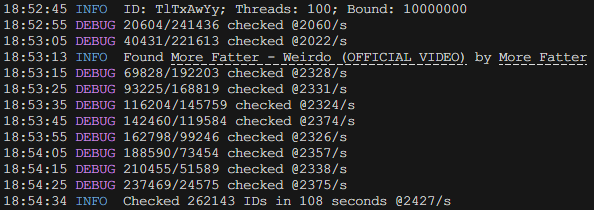

# Bruty

- [Bruty](#bruty)
  - [Running (building from source)](#running-building-from-source)
  - [Usage](#usage)
  - [Notes](#notes)
  


Brute forces the rest of a YouTube link when you have *part* of it, but not the full link. It successfully obtained `TlTxAwYypvs` a valid YT vid link from `TlTxAwYy` in **21 seconds** (at a total average of 2.9K requests per second).

## Running (building from source)

1. Install [Rust](https://www.rust-lang.org/tools/install).
2. Download and extract the repository from [here](https://github.com/skifli/bruty/archive/refs/heads/master.zip). Alternatively, you can clone the repository with [Git](https://git-scm.com/) by running `git clone https://github.com/skifli/bruty` in a terminal.
3. Navigate into the `/src` directory of your clone of this repository.
4. Run the command `cargo build --release` in the terminal to build the program.
5. The compiled binary will be located at `/target/release/`, named **`bruty.exe`** if you are on Windows, else **`bruty`**.

## Usage

> [!NOTE]
> The program *may* in extremely rare cases output the incorrect amount of permutations tested at the end, rest assured this is purely **visual** and it *has* tested all possible IDs.

```
Brute-forces the rest of a YouTube video ID when you have part of it

Usage: bruty [OPTIONS] <ID>

Arguments:
  <ID>  YouTube ID to start brute-forcing from

Options:
  -t, --threads <THREADS>            Number of threads to use [default: 100]
  -b, --bound <BOUND>                Bound for permutations channel before blocking more generation [default: 10000000]
  -l, --log <LOG>                    Log file to write to (won't be overwritten) [default: bruty.log]
  -l, --log-interval <LOG_INTERVAL>  How long to wait between info logs (in seconds) [default: 10]
  -h, --help                         Print help
  -V, --version                      Print version
```

## Notes

* When the program says `x/y checked` it actually means **`x`** permutations have been checked, and **`y`** permutations need to be checked. Not **`y`** permutations in total will be checked. That is why that number will decrease over time.
